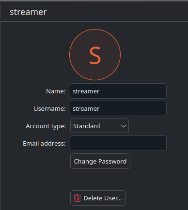

# sunshine-bazzite-script
Scripts to get a Sunshine setup running on Bazzite with a virtual display (custom EDID + headless VKMS).

## Scripts
- `virtual_display_setup.sh` — build and install a custom EDID RPM. Prompts for your EDID `.bin`, layers prerequisites if needed, patches initramfs, and appends the kernel arg.
- `virtual_display_update.sh` — update the EDID RPM in place. Detects the installed `edid_patch` name from `rpm-ostree status`, prompts for a new EDID `.bin`, rebuilds, and reinstalls.
- `virtual_display_uninstall.sh` — remove the EDID patch. Detects/removes the `edid_patch` RPM, deletes the dracut config, removes any `drm.edid_firmware=edid/...` karg, disables the custom initramfs, and reboots.
- `setup_sunshine_scripts.sh` — installs the Sunshine prep/cleanup scripts to `~/.local/bin`, writes `global_prep_cmd` to `~/.config/sunshine.conf`, and creates/enables a user service (`wake_displays_from_sleep.service`) to run `force_display_wake.sh` after resume.
- `sunshine_sleep.sh` / `sunshine_cancel_sleep.sh` — start/stop a per-user 60s suspend timer without sudo. Called by the prep/undo scripts.
- `streamer_autologin.sh` — setups up and enables `unlock-streamer-on-resume.service` (auto-unlock after resume/WoL) and `lock-streamer-on-sunshine-exit.service` (relock on disconnect).
- `setup_startup_failsafe_service.sh` — optional; installs a per-user systemd service that runs `sunshine_undo.sh` on login to recover if only the prep ran.
- `uninstall.sh` — modular uninstaller with flags for the EDID patch, Sunshine helper scripts/wake unit, streamer autologin hooks, and the failsafe service. Supports `--all`, `--dry-run`, and `--target-user`.

## Requirements
- Bazzite with `rpm-ostree`
- Root privileges (writes to `/etc`, manages systemd, installs layered packages)
- An EDID binary file to feed the scripts

## Usage (EDID)

### Prerequisite Steps
1) Clone this repo.
2) Run `ujust setup-sunshine` if not done already. 
3) Run `for p in /sys/class/drm/*/status; do con=${p%/status}; echo -n "${con#*/card?-}: "; cat $p; done` to find a list of GPUs' free DP or HDMI output.
4) Edit connector names to match your hardware: in `virtual_display_setup.sh` replace `HDMI-A-1` in the `drm.edid_firmware` arg with the target output, in `sunshine_do.sh`/`sunshine_undo.sh`, and in `force_display_wake.sh` replace the default `HDMI-A-1`, `DP-1`, and `DP-2` connector names with the ones you found in step 3.

### Installation
0) Kill the Sunshine Process
1) Run `sudo ./virtual_display_setup.sh` and supply your EDID `.bin` path when prompted. The script builds/installs `edid_patch`, updates initramfs, and appends the kernel arg, then reboots.
2) Run `sudo ./setup_sunshine_scripts.sh`. This installs the Sunshine prep/cleanup scripts to `~/.local/bin`, writes `~/.config/sunshine.conf`, and drops/enables a per-user systemd unit `~/.config/systemd/user/wake_displays_from_sleep.service` that runs `~/.local/bin/force_display_wake.sh` after resume:
```
global_prep_cmd = [{"do":"bash -c \"${HOME}/.local/bin/sunshine-do.sh \\\"${SUNSHINE_CLIENT_WIDTH}\\\" \\\"${SUNSHINE_CLIENT_HEIGHT}\\\" \\\"${SUNSHINE_CLIENT_FPS}\\\" \\\"${SUNSHINE_CLIENT_HDR}\\\"\"","undo":"bash -c \"${HOME}/.local/bin/sunshine-undo.sh\""}]
```
3) Restart Sunshine.

Notes:
- The sleep helper scripts do not need sudo. They use per-user state under `${XDG_RUNTIME_DIR:-/tmp}` and `loginctl`/`systemctl` to suspend.
- If you run them directly from the repo, ensure they are executable (`chmod +x sunshine_sleep.sh sunshine_cancel_sleep.sh`). The setup script handles this for the installed copies.

### Optional but HIGHLY RECOMMENDED
Run `setup_startup_failsafe_service.sh`. This makes it to where it runs the `sunshine_undo.sh` script on startup in the event that when connecting to Sunshine only the `sunshine_do.sh` script runs. This can help fix black screens after logging in. (Ask me how I know :] )

### Update edid_patch
1) To swap to a new EDID later, run `sudo ./virtual_display_update.sh`, provide the new `.bin`, and reboot when prompted.

### Uninstall
1) For a modular cleanup (EDID patch, helper scripts/wake unit, autologin hooks, failsafe), run `sudo ./uninstall.sh --all` or pick flags (`--virtual-display`, `--sunshine-scripts`, `--streamer-autologin`, `--failsafe-service`). Use `--dry-run` to preview actions.
2) Reboot

## Example EDID
The provided example_edid.bin supports various resolutions including 4K@60, 2420x1668@120Hz (iPad Pro), and 1280x800@90Hz, among other common resolutions.

## Custom EDIDs
It is recommended to use the `samsung-q800t-hdmi2.1` EDID from [v4l-utils](https://git.linuxtv.org/v4l-utils.git/tree/utils/edid-decode/data). Use [Custom Resolution Utility (CRU)](https://customresolutionutility.net/) to add more resolutions to the base EDID and export. CRU works fine under Wine.

## Default Steam Launch Commands
`LD_PRELOAD=""
PROTON_HIDE_NVIDIA_GPU=0 
PROTON_ENABLE_NVAPI=1 
gamescope -f -b 
    -H $(kscreen-doctor -j | jq '.screen.currentSize.height') 
    --hdr-enabled 
    --adaptive-sync 
    -- %command%
`

## Steam Big Picture Lag Fix
From /u/psirrow:
```
If you're still having the problem (or for anyone else who finds this post), I had the same issue but I solved it by ticking a few more settings. This is what I have:

in "Settings/Display" I have:

    "Disable GPU Blocklist" on

in "Settings/Interface" I have:

    "Enable smooth scrolling in web views" on (may not be necessary)

    "Enable GPU accelerated rendering in web views" on

    "Enable hardware video decoding, if supported" on
```

## Creating a "streaming" user that autologins
1) Type in `users` in start menu and use the GUI to create a standard user. Note: You have to enter a password for this user to be created.



2) From this repo, run `sudo ./streamer_autologin.sh`. It installs/enables:
   - `unlock-streamer-on-resume.service`: auto-unlocks the `streamer` session when the machine resumes (handy after WOL).
   - `lock-streamer-on-sunshine-exit.service`: re-locks the `streamer` session when the Sunshine client disconnects.
3) OPTIONAL: Set proper permissions for the game drives using:
```
sudo setfacl -R -m u:streamer:rwx /run/media/system/[drive_name_here]
```
and to make it default
```
sudo setfacl -R -m d:u:streamer:rwx /run/media/system/[drive_name_here]
```
## Credits
https://www.reddit.com/r/Bazzite/comments/1gajkpg/add_a_custom_resolution/  
/u/Acru_Jovian  
https://gist.github.com/iamthenuggetman/6d0884954653940596d463a48b2f459c  
https://www.azdanov.dev/articles/2025/how-to-create-a-virtual-display-for-sunshine-on-arch-linux
https://www.reddit.com/r/linux_gaming/comments/1h2o0re/comment/mtq730l/
